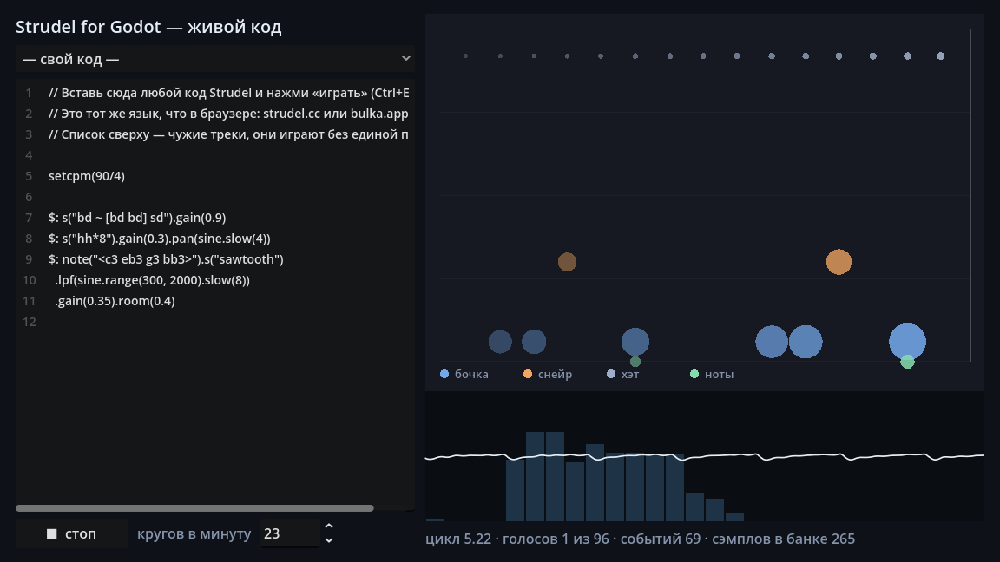
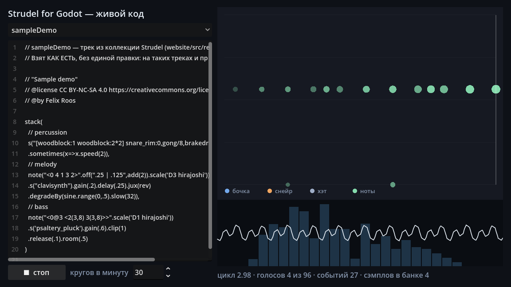
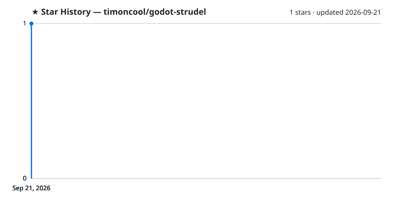

<div align="center">

# Strudel for Godot

**Run Strudel live-coding patterns inside Godot — paste the code you wrote in the browser, unchanged, and hear it in your game.**

[](LICENSE)
[](https://github.com/timoncool/godot-strudel/stargazers)
[](https://github.com/timoncool/godot-strudel/commits)
[](https://godotengine.org)

**[English](README.md)** · **[Русский](README_RU.md)**



</div>

Strudel for Godot is a **port of the Strudel pattern engine to GDScript** — patterns, mini-notation, tonal functions, sampler, synths, effects and a sample-accurate scheduler, all running inside the engine. Write music as code in [strudel.cc](https://strudel.cc) or [bulka.app](https://bulka.app), then paste the same text into your game. No native binaries, no network, no build step: it is pure GDScript, installs like any addon and runs everywhere Godot runs.

It exists because game music written in a bespoke data format cannot be heard outside the game. With Strudel you compose in a browser, hear it immediately, and ship the exact same code.

## Features

- **Paste Strudel code unchanged** — `const`, arrow functions, `$:`, method chains, mini-notation strings all work as written
- **Verified against the real thing** — all **32 community tunes** from Strudel's own collection, 143 of 144 reference expressions and a full 2449-event track produce *bit-identical* events to live Strudel; **213 of 213 functions and 499 of 499 controls** covered; see [docs/COMPARISON.md](docs/COMPARISON.md)
- **Exact time** — positions are rational numbers, never floats, so beats do not drift on long forms
- **Sample-accurate scheduling** — the clock is the audio frame counter, not `_process`, so frame drops never shift the beat
- **Your own samples** — point it at a folder; reads Strudel-format sample maps (`strudel.json`, `vcsl.json`, multisampled instruments)
- **Empty bank is fine** — with no samples at all everything plays through synths instead of failing
- **Live changes** — swap the pattern or the tempo mid-play without a click and without resetting the bar
- **Music drives the game** — a signal fires on every pattern event with its full parameter set
- **Pure GDScript** — no GDExtension, no per-platform binaries; works in exported Windows, Linux, Android and Web builds

## Quick Start

1. **Install** — copy `addons/strudel/` into your project, then enable **Strudel** in *Project → Project Settings → Plugins*.

2. **Play three lines**

   ```gdscript
   var music := StrudelPlayer.new()
   add_child(music)
   music.play('s("bd sd*2, ~ hh")')
   ```

3. **Paste your own** — anything you wrote in Strudel or Bulka goes in as-is:

   ```gdscript
   music.play("""
   setcpm(120/4)
   $: stack(
     s("bd ~ bd ~"),
     s("hh*8").gain(0.35),
     n("0 2 4 <6 5>").scale("C4:minor").s("triangle").room(0.4)
   )
   """)
   ```

## Usage

### Reacting to the music

```gdscript
music.event_played.connect(func(value: Dictionary):
    if value.get("s") == "bd":
        camera.shake(0.2)
)
```

`value` is the event's full parameter dictionary — `s`, `note`, `gain`, `pan`, `speed` and everything else the pattern set.

### Live changes

```gdscript
music.set_code('s("bd*4, hh*16")')   # bar keeps running, no click
music.set_cycles_per_second(0.75)     # tempo changes in place
```

### Your own samples

Point `samples_path` at a folder of `.wav` files, or at a folder containing Strudel-format `.json` sample maps. Sub-folder names become instrument names, so `kicks/01.wav` is reachable as `s("kicks")`, and `s("kicks:1")` picks the second file.

### Building patterns from GDScript

The string form is the main entrance; patterns can also be assembled directly:

```gdscript
var beat := StrudelPattern.stack([
    StrudelMini.mini("bd sd"),
    StrudelMini.mini("hh*8").gain(0.3),
])
music.set_pattern(beat)
```

## Configuration

| Property | Meaning |
|---|---|
| `code` | Strudel source. Assigning it while playing swaps the pattern live |
| `samples_path` | Folder with `.wav` files and/or Strudel sample maps. Empty means synths only |
| `cycles_per_minute` | Tempo. `setcpm(...)` inside the code overrides it |
| `bus` | Output bus. The plugin never creates or touches buses of its own |
| `lookahead` | How far ahead events are computed, in seconds |
| `max_voices` | Polyphony limit. Beyond it voices are evicted — and counted, never silently |
| `master_limiter` | Soft output limiting. Off by default, because Strudel has none either |

## What is Strudel?

[Strudel](https://strudel.cc) is a live-coding language for music: rhythm, harmony and effects written as short expressions that you edit while they play. It is a JavaScript port of [TidalCycles](https://tidalcycles.org), and it runs in any browser — nothing to install.

[Bulka](https://bulka.app) is a fork of Strudel with a built-in assistant and an MCP server, which makes it a comfortable place to *compose* a track before handing it to a game. This plugin was written against Bulka and verified against it event by event.

Neither is required to use this plugin — but writing music in a browser where you hear every change instantly, then pasting the result into Godot, is the workflow it was built for.

## Documentation

- [docs/SYNTAX.md](docs/SYNTAX.md) — what is supported, what is not, and what differs
- [docs/COMPARISON.md](docs/COMPARISON.md) — how equivalence with Strudel is measured, with numbers
- [docs/PORTING-RULES.md](docs/PORTING-RULES.md) — the porting policies the code follows
- [NOTICE.md](NOTICE.md) — provenance and what the AGPL license means for your project

## Examples

| Example | Shows |
|---|---|
| `examples/01_minimal_beat` | The three-line case |
| `examples/02_own_samples` | Your own sample folder, in Strudel's map format |
| `examples/03_game_reacts` | Game visuals driven by pattern events |
| `examples/04_full_track` | A complete 16-section track, ported unchanged |
| `examples/05_community_tunes` | All 32 community tunes from Strudel's own collection — space cycles through them |
| `examples/07_repl` | Live-coding player: paste Strudel code, hear it, watch the events and the output scope |



## Other Projects by [@timoncool](https://github.com/timoncool)

| Project | Description |
|---------|-------------|
| [Bulka](https://bulka.app) | Strudel fork with an AI assistant and an MCP server |
| [ACE-Step Studio](https://github.com/timoncool/ACE-Step-Studio) | Portable AI music generator — songs with vocals, covers, videos |

## Credits

Strudel is by Alex McLean and the Strudel contributors. This plugin is a port of their work, not an independent implementation; every ported file names its original in the header.

## Support the Author

I build open-source software and do AI research. Most of what I create is free and available to everyone. Your donations help me keep creating without worrying about where the next meal comes from =)

**[All donation methods](https://github.com/timoncool/ACE-Step-Studio/blob/master/DONATE.md)** | **[dalink.to/nerual_dreming](https://dalink.to/nerual_dreming)** | **[boosty.to/neuro_art](https://boosty.to/neuro_art)**

- **BTC:** `1E7dHL22RpyhJGVpcvKdbyZgksSYkYeEBC`
- **ETH (ERC20):** `0xb5db65adf478983186d4897ba92fe2c25c594a0c`
- **USDT (TRC20):** `TQST9Lp2TjK6FiVkn4fwfGUee7NmkxEE7C`

## Star History

<a href="https://github.com/timoncool/godot-strudel/stargazers">
 <picture>
   <source media="(prefers-color-scheme: dark)" srcset="docs/stars-dark.svg" />
   <source media="(prefers-color-scheme: light)" srcset="docs/stars-light.svg" />
   
 </picture>
</a>

## License

**AGPL-3.0-or-later** — the same license as Strudel, because this is a port of it. If you distribute a game together with this plugin, that game falls under the same terms. Read [NOTICE.md](NOTICE.md) before shipping.
